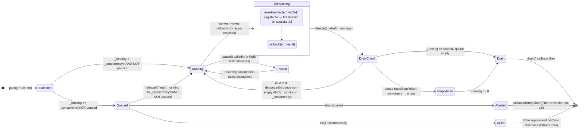

# fastq — Architecture Overview

> **Audience:** New engineers onboarding to the `fastq` codebase.  
> **Scope:** End-to-end task lifecycle, concurrency model, pause/resume semantics, and event emission points.

---

## 1. System Overview

`fastq` is a high-performance, in-memory concurrency task queue that throttles concurrent execution of asynchronous work. It sits between **task producers** (`push`/`unshift` callers) and **task workers** (user-supplied callback or async functions), enforcing a hard concurrency ceiling while maintaining a singly-linked-list of pending tasks.

There are two entry-points into the system:

| Module | Interface | Worker convention |
|---|---|---|
| `src/queue.js` | Callback-based (`push(value, cb)`) | `worker(task, callback)` |
| `src/promise.js` | Promise-based (`push(value) → Promise`) | `async worker(task)` |

`promise.js` is a thin facade over `queue.js`; all concurrency logic lives exclusively in `queue.js`.

---

## 2. Task Lifecycle — State Diagram



---

## 3. Concurrency Throttle Mechanism

The concurrency ceiling is enforced by a single integer counter `_running` and two comparison gates:

```
Gate A — push/unshift (line 126, queue.js):
  if (_running >= _concurrency || paused) → QUEUE the task
  else → DISPATCH immediately, _running++

Gate B — release() (line 170, queue.js):
  if (queueHead && _running <= _concurrency && !paused) → DEQUEUE + DISPATCH
  else → _running--; if (_running === 0) → drain()
```

> **⚠ Fencepost note:** Gate A uses `>=` (strict ceiling), Gate B uses `<=` (allows at-capacity dequeue). This inconsistency can permit momentary over-concurrency during concurrent concurrency-setter modifications. See `DANGER_ZONES.md §7`.

### Worker Pool Refill Loop

```
task completes
    └── worked() fires
            └── release(task) called
                    ├── return task to object pool (reusify)
                    ├── dequeue next task if available
                    │       └── dispatch to worker (_running++)
                    │               └── fires empty() if queue now empty
                    └── if no next task
                            ├── _running--
                            └── if _running === 0 → drain()
```

---

## 4. Pause / Resume Semantics

```
pause()
  └── self.paused = true
        └── release() checks paused → skips dispatch
              └── _running decrements for completing tasks
                    └── drain() NOT fired while paused

resume()
  └── self.paused = false
        └── if queue non-empty: loop, _running++, call release()
              → drains queue up to concurrency limit
        └── ⚠ if queue EMPTY but _running > 0: spurious _running++ (Bug — see DANGER_ZONES §2)
```

---

## 5. Object Pool (reusify)

Task objects are managed by a **reusify** pool to avoid GC pressure:

- Allocation: `cache.get()` on every `push`/`unshift`
- Return: `cache.release(task)` at the start of `release()` and at the end of `abort()` iteration

If `release()` or `worked()` throws before reaching `cache.release()`, the Task object leaks from the pool permanently.

---

## 6. Promise Facade Layer (`promise.js`)

```
asyncWorker (user)
      │  returns Promise
      ▼
asyncWrapper (lines 276–281)
      │  .then(res => cb(null, res), cb)   ← bridges Promise → callback
      ▼
queue.js Task lifecycle (callback path)
      │  worked() → callback(err, result)
      ▼
Promise executor callback (lines 296–302 / 315–321)
      │  reject(err)  OR  resolve(result)
      ▼
Caller's awaited Promise

p.catch(noop) attached immediately to prevent unhandledRejection
if caller drops the returned Promise (⚠ silences errors — see DANGER_ZONES §1-promise)
```

### `drained()` flow

```
drained() called
  └── defer (nextTick / queueMicrotask)
        ├── if idle() → resolve immediately (drain NOT called)
        └── else: previousDrain = queue.drain
                  queue.drain = () => { previousDrain(); resolve(); queue.drain = previousDrain }
                       └── fires when _running === 0 AND queue empty
```

---

## 7. Event Emission Summary

| Event | Trigger condition | Fired by |
|---|---|---|
| `saturated()` | Queue transitions empty → non-empty while at capacity | `push()` / `unshift()` |
| `empty()` | Queue transitions non-empty → empty during dequeue | `release()` |
| `drain()` | `_running === 0` AND queue empty | `release()` |
| `error(handler)` | Any task completion — **including successes** ⚠ | `worked()` |

---

## 8. Module Dependency Map

```mermaid
graph TD
    Consumer["Consumer Code"] -->|push / unshift| QueueJS["src/queue.js\n(core scheduler)"]
    Consumer -->|push / unshift\n(returns Promise)| PromiseJS["src/promise.js\n(promise facade)"]
    PromiseJS -->|asyncWrapper + pushCb| QueueJS
    QueueJS -->|cache.get / cache.release| Reusify["reusify\n(object pool)"]
    QueueJS -->|drain / empty / saturated| Callbacks["User Callbacks"]
    PromiseJS -->|resolve / reject| Promises["User Promises"]
    TestCB["src/test/test.js\n(callback tests)"] -.->|exercises| QueueJS
    TestP["src/test/promise.js\n(promise tests)"] -.->|exercises| PromiseJS
```
